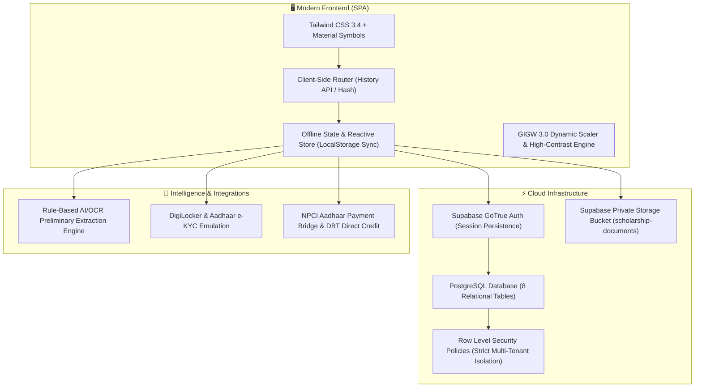

# 🏛️ National Tribal Scholarship Portal (NTSP)
### 🚀 *The Next-Gen Digital Scholarship & Fellowship Operating System for Tribal Youth*
> **Ministry of Tribal Affairs (MoTA) • Government of India**  
> *Architected with ❤️ by [@avijiitt](https://github.com/avijiitt)*

---

<div align="center">


[](https://st-scholarship.vercel.app)
[](https://supabase.com)
[](https://st-scholarship.vercel.app)
[](https://digilocker.gov.in)
[](https://st-scholarship.vercel.app)
[](LICENSE)

### 🌟 **Live Production App**: [**st-scholarship.vercel.app**](https://st-scholarship.vercel.app) 🌟

</div>

---

## ⚡ The Vibe Check (Why We Built This)

Let’s be real for a sec: traditional government scholarship portals are pain. Endless paper physical submissions, obscure verification gates, "babu" offices with zero transparency, weeks of ghosting, and rejected forms because someone couldn't read a blurry seal. 💀

**NTSP is the antidote.** We flipped the entire paradigm upside down. 

No paperwork. No gatekeeping. No guessing where your scholarship is stuck.
Just slick, real-time, transparent education funding with AI assistance, instant DigiLocker e-KYC, automated eligibility evaluation, and bank-grade DBT disbarment direct to Aadhaar-seeded accounts.

---

## 🔥 Key Flexes & Superpowers

```
  ┌─────────────────────────────────────────────────────────────┐
  │  🎯 100% Paperless • 🤖 AI-OCR Assisted • ⚡ Realtime Loop   │
  └─────────────────────────────────────────────────────────────┘
```

### 1. 🎓 Top-Tier Schemes Out-Of-The-Box
- **National Overseas Scholarship (`NOS`)**: 100% fully-funded grants covering tuition, living expenses, and international flights for Scheduled Tribe scholars at **QS Top 500 Universities** worldwide (Oxford, Imperial, Cambridge, Harvard).
- **National Fellowship for ST Students (`NFST`)**: Monthly doctoral research stipend up to **₹38,000/month** + annual contingency grants for regular full-time scholars in IITs, NITs, and Central Universities.
- **Post-Matric Scholarship (`PMS`)**: 100% compulsory fee reimbursement and maintenance allowances across accredited higher education institutions in India.
- **Pre-Matric Scholarship for ST Students (`PRE`)**: Centrally sponsored scheme for **Class IX & X** ST scholars to minimize transition drop-outs (Day Scholars: ₹3,000/yr, Hostellers: ₹6,250/yr; Income ceiling ≤ ₹2.50 Lakhs/yr).
- **UGC PG Scholarship for Professional Courses (`UGC-PG`)**: 1,000 annual national slots for SC/ST students entering 1st year regular PG professional degrees (ME/M.Tech: ₹7,800/mo, MBA/MCA/M.Pharm/LLM: ₹4,500/mo; 2-3 yrs tenure).

### 2. 🤖 AI-Assisted Preliminary Verification & OCR Engine
- **Instant scan analysis**: OCR extracts candidate name, DOB, certificate registration number, and annual family income in real-time.
- **Match confidence scoring**: Instant match indicators (`98% Name Match`, `100% DOB Match`, `QR Seal Detected`).
- **Scrutiny anomaly detection**: Automatic flags for expired financial year endorsements, blurred issuing stamps, or missing university offer letter clauses.
- **Constitutional safety guardrail**:
  > *"AI provides preliminary assistance only. Final verification remains with the authorised officer."*

### 3. 🔁 The Deficiency Resolution Loop *(Our Game-Changing Feature)*
- Most portals **instantly reject** incomplete forms or force scholars into bureaucratic appeals.
- **NTSP has a built-in Deficiency Desk**:
  - Officer marks an exact document (e.g. *Income Certificate*) with a precise query (*"Renewal endorsement for current financial year needed"*).
  - Scholar receives an instant in-app ping + deadline (`Action required: Income certificate needs replacement`).
  - Scholar uploads a fresh scan directly in the portal.
  - Status updates automatically (`under_scrutiny` ➔ `deficiency_raised` ➔ `resubmitted` ➔ `under_scrutiny`) with a 100% tamper-proof audit trail!

### 4. 🎛️ Zero-Code Scheme Administration *(Innovation Highlight)*
- Want to deploy a brand-new scholarship scheme? **Zero frontend/backend code redeployment required.**
- Nodal officers can configure scheme names, quotas, education levels, domestic vs. abroad rules, income ceilings, required document sets, selection stages, and notifications dynamically from the Admin Console.

### 5. 🛡️ Bank-Grade Security & Row Level Security (RLS)
- **Zero service_role keys in browser code**: Frontend communicates exclusively through authenticated sessions and anon JWTs.
- **PostgreSQL Row Level Security**: Student A can never query Student B's application or documents.
- **Private Supabase Storage**: Files stored in private buckets at `{user_id}/{application_id}/{document_type}/{random_hash}.pdf` with signed token verification and strict 5 MB MIME validation.

### 6. ♿ GIGW 3.0 Accessible & Mobile-First
- Dynamic font scaler (`A-`, `A`, `A+`), High-Contrast Dark Theme toggle, screen reader keyboard accessibility (`Tab` navigable, `Skip to content`), and 100% responsive Tailwind layout.

---

## 🛠️ The Tech Stack



| Layer | Tech | Purpose |
|---|---|---|
| **Frontend Framework** | Vanilla ES6+ SPA Architecture | Zero build-step bloat, ultra-low bundle size, instant TTFB |
| **Styling & Design** | Tailwind CSS + Google Material Symbols | Modern GIGW-compliant government portal aesthetic |
| **Database & Auth** | Supabase (PostgreSQL 15) | Relational integrity, migrations version control, real-time data |
| **Access Control** | Postgres Row-Level Security (RLS) | Hardened student isolation, role-based admin scrutiny |
| **Document Storage** | Supabase Storage (Private) | 5 MB PDF/JPG/JPEG limit, user-isolated directory paths |
| **Verification Engine** | Rule-Based AI/OCR Engine | Automated field extraction, mismatch detection, and scoring |
| **Deployment** | Vercel Edge Network | High availability, edge caching, HTTPS worldwide |

---

## 🚦 System Architecture & End-to-End Workflow

```
[Scholar] ──> Register / Login (OTR ID) 
              └──> Choose Scheme (NOS / NFST / PMS)
                   └──> 5-Step Application Wizard
                        └──> Document Vault & AI Pre-Check
                             └──> Legal E-Declaration & Submit
                                  │
                                  ▼
[Officer] ◄── Scrutiny Queue (Realtime Database Intake)
              ├── Approve ──> Provisionally Eligible ──> Committee Screening ──> PFMS DBT
              ├── Reject  ──> Rejected with Justification
              └── Deficiency Raised ──┐
                                      ▼
[Scholar] ◄──────────────── Notification: Action Required
              └── Uploads Corrected Document at Deficiency Desk
                  └── Status: Resubmitted ──> Back to Officer Queue ↺
```

---

## 🧪 Seeded Demo Personas & Scenarios

To explore the entire ecosystem without setting up fresh mock profiles, you can test these pre-loaded scenarios:

### 👤 1. Scholar Demo Persona
- **Candidate**: `Priya Kumari` (Bihar)
- **OTR ID**: `OTR-2025-ST-109283`
- **Scheme**: National Overseas Scholarship (`NOS`)
- **Credentials**: `priya.munda@email.com` / `Scholar@2025`
- **Application Status**: `Submitted` ➔ Live Tracking available at `#/application/track`

### 👤 2. Deficiency Demonstration Persona
- **Candidate**: `Ramesh Gond` (Madhya Pradesh)
- **Scheme**: National Fellowship for ST Students (`NFST`)
- **Status**: `Deficiency Raised`
- **Issue**: *"Income Certificate unclear / expired financial year endorsement."*
- **Action**: Visit `#/application/deficiency` to resolve query live!

### 👤 3. Provisionally Eligible Persona
- **Candidate**: `Anita Kerketta` (Jharkhand)
- **Scheme**: National Overseas Scholarship (`NOS`)
- **Status**: `Provisionally Eligible` (Forwarded to Committee Screening)

### 🛡️ 4. Nodal Scrutiny Officer
- **Officer**: `Shri K. S. Verma (Deputy Secretary, MoTA)`
- **Portal URL**: `#/admin/login`
- **Credentials**: `admin@mota.gov.in` / `Admin@2025`
- **Capabilities**:
  - Live Scrutiny Queue with search & multi-criteria filters
  - Detailed Candidate Dossier & OCR inspection
  - Interactive AI Verification Screen with confidence scores
  - One-click Document Attestation
  - Interactive Deficiency Notice Dispatcher with deadline calendar
  - Zero-code Scheme Management (`#/admin/schemes`)

---

## 🏃 Local Development Quickstart

### Prerequisites
- Node.js 18+ or Python 3.8+ (any static file server works!)

### 1. Clone the Repo
```bash
git clone https://github.com/avijiitt/st-scholarship.git
cd st-scholarship
```

### 2. Configure Environment
```bash
cp .env.example .env
```
*(Your `.env` only requires `SUPABASE_URL` and `SUPABASE_ANON_KEY`. Never place `service_role` keys in client-side apps!)*

### 3. Run Locally
Using Python:
```bash
python server.py
# Open http://localhost:8000
```
Or using Node:
```bash
npx serve .
# Open http://localhost:3000
```

### 4. Run Automated Test Verification
We maintain comprehensive verification test suites under `scratch/`:
```bash
# Verify complete vertical scholar flow (10/10 steps)
node scratch/verify_vertical_flow.js

# Verify ministerial admin scrutiny & deficiency workflow (52/52 checks)
node scratch/verify_admin_workflow.js

# Verify comprehensive system security, RLS & validation (80/80 checks)
node scratch/verify_final_system_tests.js
```

---

## 📚 Complete Technical Documentation

For the comprehensive deep dive into database schema, state transitions, security RLS audits, and the full 14-step presentation demonstration script, check out:

👉 [**WORKFLOW.md — Complete Technical & Operational Architecture**](WORKFLOW.md)

---

## 🤝 Contributing & Community

Contributions are what make the open source community such an incredible place to learn, inspire, and create. Any contributions you make are **greatly appreciated**.

1. Fork the Project
2. Create your Feature Branch (`git checkout -b feature/AmazingFeature`)
3. Commit your Changes (`git commit -m 'feat: Add some AmazingFeature'`)
4. Push to the Branch (`git push origin feature/AmazingFeature`)
5. Open a Pull Request

---

## 📜 License & Compliance

Distributed under the **MIT License**. Compliant with **GIGW 3.0 (Guidelines for Indian Government Websites)** and **MeitY Cyber Security Directives**.

---

<div align="center">

**National Tribal Scholarship Portal (NTSP)**  
*Empowering Tribal Scholars • Fostering Self-Reliance • Building Viksit Bharat 2047* 🇮🇳

</div>
